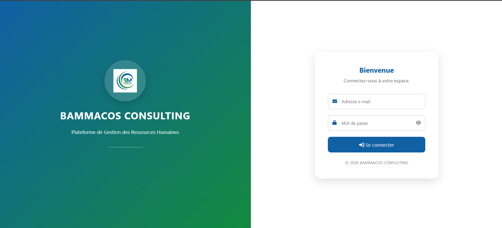
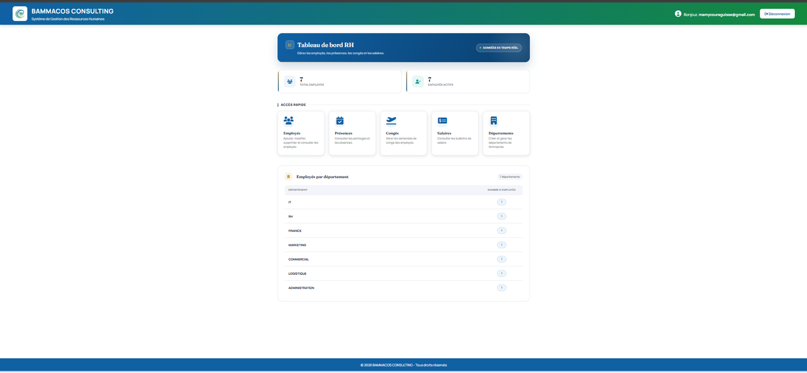
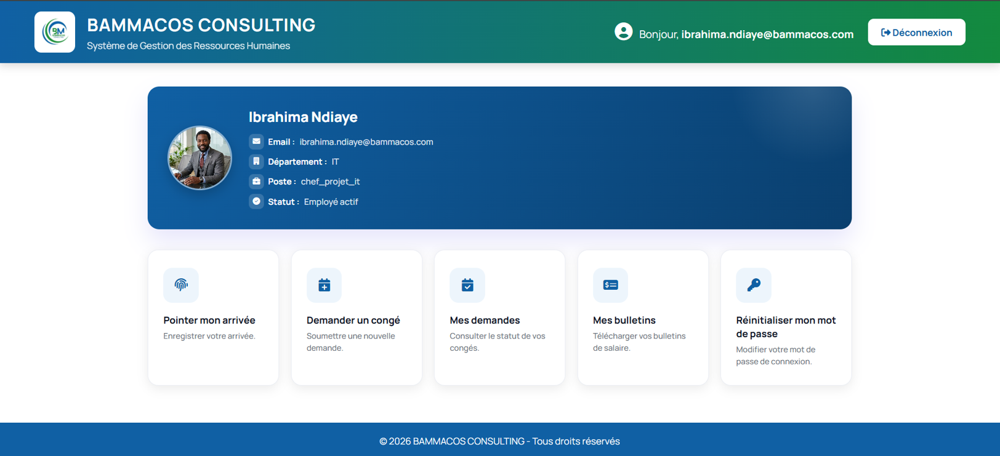
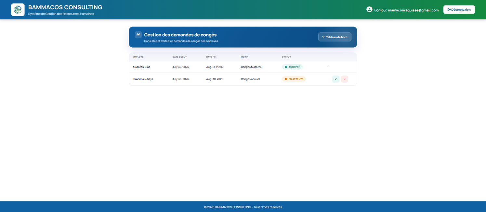
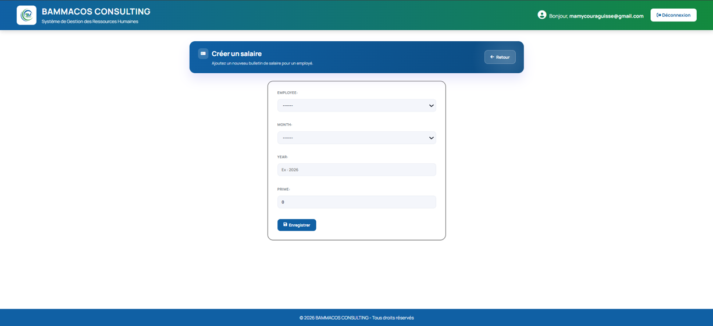

# 🧑‍💼 Application de Gestion des Ressources Humaines (Django)

## 📖 Description

Cette application web de gestion des ressources humaines a été développée dans le cadre de mon Projet de Fin d'Études (PFE) de Master en Ingénierie de Développement et de Conception d'Applications. Elle permet de gérer efficacement les employés, les départements, les congés, les présences et les salaires à travers une interface intuitive et sécurisée.

---

## ✨ Fonctionnalités

- 🔐 Authentification sécurisée des utilisateurs
- 👨‍💼 Gestion des employés
- 🏢 Gestion des départements
- 📅 Gestion des congés
- ⏰ Gestion des présences
- 💰 Gestion des salaires
- 📊 Tableau de bord RH avec statistiques
- ⚙️ Interface d'administration Django

---

## 🛠️ Technologies utilisées

- Python
- Django
- HTML5
- CSS3
- JavaScript
- Bootstrap
- SQLite

---

## 📸 Captures d'écran

### 🔑 Connexion



### 📊 Tableau de bord



### 👨‍💼 Gestion des employés



### 🏢 Gestion des départements


### 📅 Gestion des congés



### 💰 Gestion des salaires



---

## 🚀 Installation

bash
git clone https://github.com/Kiittyg/Gestion_RH-django.git

cd Gestion_RH-django

pip install -r requirements.txt

python manage.py migrate

python manage.py runserver
```

---

## 👩‍💻 Auteur

**Mamy Coura Guissé**

Master en Ingénierie de Développement et de Conception d'Applications

Projet réalisé dans le cadre du Projet de Fin d'Études (PFE).
